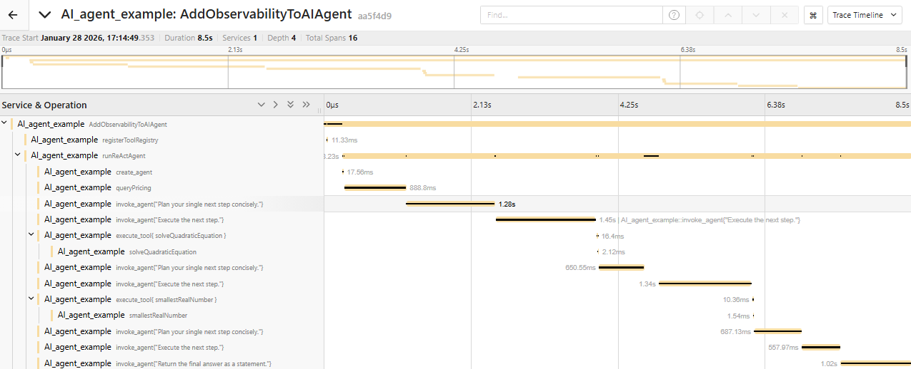
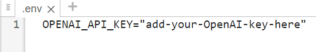
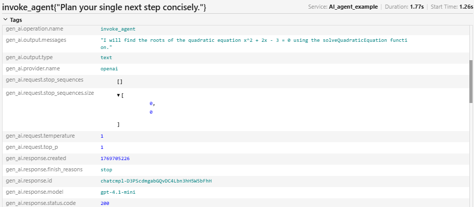

# Add OpenTelemetry Observability to an AI Agent

This example shows how to add OpenTelemetry observability to an AI Agent. Observability enables monitoring of the requests sent to the agent, which can help with troubleshooting and optimization. In this example, [OpenTelemetry](https://opentelemetry.io/) is used to capture telemetry data including traces and metrics. OpenTelemetry is an open\-source observability framework that provides a standard way to generate, collect, and export telemetry data without vendor lock\-in.

The original example being instrumented is taken from the[ "Solve Simple Math Problem Using AI Agent"](https://github.com/matlab-deep-learning/llms-with-matlab/blob/main/examples/SolveSimpleMathProblemUsingAIAgent.md) example in the ["Large Language Models (LLMs) with MATLAB"](https://github.com/matlab-deep-learning/llms-with-matlab) package. It shows how to build an AI agent to find the smallest root of a quadratic equation. 

AI agents are programs that autonomously plan and execute workflows. Typically, agents use large language models (LLMs) to process user queries and identify actions that need to be taken, also known as *tool calls*. The agent then executes the tool calls that the LLM has identified and returns the result to the LLM. Then, the LLM generates an answer or executes more tool calls.

The following is a trace that shows the workflow in this example. For more information about tracing, see this[ introduction](https://opentelemetry.io/docs/concepts/signals/traces/) in the OpenTelemetry website. 



 *Screenshot taken from Jaeger. Used with permission from the Jaeger project. This way to* [*jaegertracing.io*](https://www.jaegertracing.io)*.*

# Prerequisites

This example requires the following add\-on packages to be installed in MATLAB. Use the Add\-on Explorer to download and install them.

- [Large Language Models (LLMs) with MATLAB](https://github.com/matlab-deep-learning/llms-with-matlab)
- [MATLAB Interface to OpenTelemetry](https://github.com/mathworks/OpenTelemetry-MATLAB)

In addition, the following softwares are necessary to collect the generated telemetry data. 

- [OpenTelemetry Collector](https://opentelemetry.io/docs/collector/)
- A tracing backend. For example, Jaeger ([https://www.jaegertracing.io/](https://www.jaegertracing.io/))
- A metrics backend. For example, Prometheus [(https://prometheus.io/](http://(https//prometheus.io/))

The OpenTelemetry Collector is a component that uses configurable pipelines to ingest telemetry data in different formats, transform it, and send it to one or more backends. It decouples the instrumented applications from the backends and therefore enables changes to how the telemetry data is processed and where it is sent to without modifying application code. It also handles the complexities of data transmission across networks and retry logic. For details about how to configure the OpenTelemetry Collector, see the documentation at [https://opentelemetry.io/docs/collector/configuration/](https://opentelemetry.io/docs/collector/configuration/).

Before proceeding, check both required add\-on packages are installed. 

```matlab
checkRequiredPackages
```

# Initialize OpenTelemetry

OpenTelemetry needs to be initialized and configured before it can be used. This needs to be done only once in a MATLAB session. The following initialization code sets the service name as an attribute. Otherwise, it uses default configurations.

```matlab
function initializeOTel
    % Set up a global TracerProvider and MeterProvider, which are objects
    % used to store configurations 
    resource = dictionary("service.name", "AI_agent_example");  % specify a custom service name
    tp = opentelemetry.sdk.trace.TracerProvider(Resource=resource);
    setTracerProvider(tp);
    mp = opentelemetry.sdk.metrics.MeterProvider(Resource=resource);
    setMeterProvider(mp);
end


runOnce(@initializeOTel);
```

# Specify OpenAI API Key

This example uses the OpenAI® API, which requires an OpenAI API key. For information on how to obtain an OpenAI API key, as well as pricing, terms and conditions of use, and information about available models, see the OpenAI documentation at [https://platform.openai.com/docs/overview](https://platform.openai.com/docs/overview).

To connect to the OpenAI API from MATLAB® using LLMs with MATLAB, specify the OpenAI API key as an environment variable and save it to a file called ".env".



To connect to OpenAI, the ".env" file must be on the search path. Load the environment file using the [`loadenv`](https://www.mathworks.com/help/matlab/ref/loadenv.html) function.

```matlab
loadenv(".env")
```

# Capture Details of LLM Interactions

To build observability into AI Agent workflow, capture inputs, outputs, properties, and metadata of interactions with the OpenAI LLM. Start an OpenTelemetry span for each interaction, and then record LLM inputs, outputs and other data as attributes of the span. OpenTelemetry metrics can be used to aggregate quantities across multiple calls to the LLM, such as the total number of LLM calls and the total number of tokens. 

## Query Pricing

A useful metric is the cost incurred by the LLM calls. To enable tracking and controlling LLM costs, define a helper function that retrieves the current per\-token pricing from the OpenAI website. With the retrieved pricing, and the input and output token counts, the individual request costs and the total cost across all LLM calls can be computed.

```matlab
function [inputRate, outputRate] = queryPricing(modelName)
    % Start OpenTelemetry span
    trQueryPricing = opentelemetry.trace.getTracer("AddObservabilityToAIAgent");
    spQueryPricing = startSpan(trQueryPricing, "queryPricing");
    scopeQueryPricing = makeCurrent(spQueryPricing); %#ok<*NASGU>


    try
        pricing_page = "https://platform.openai.com/docs/pricing";
        prices = readtable(pricing_page, WebOptions=weboptions, FileType="html", ReadRowNames=true, ...
            TableIndex=3);  % third table is for "standard" pricing
        inputRate = str2double(extractAfter(prices{modelName, "Input"}, '$')) / 1e6;  % quoted rates are per 1M tokens
        outputRate = str2double(extractAfter(prices{modelName, "Output"}, '$')) / 1e6;
    catch
        warning("Unable to retrieve LLM pricing information.");
        inputRate = 0;
        outputRate = 0;
    end
end
```

## Capture Details of Agent Creation

At agent creation, it is useful to record agent name and description, the underlying LLM model and any system prompt sent to the LLM. 

```matlab
function llm = createAgent(modelName, systemPrompt, tools)
    % Start OpenTelemetry span
    trCreateAgent = opentelemetry.trace.getTracer("AddObservabilityToAIAgent");
    spCreateAgent = startSpan(trCreateAgent, "createAgent");
    scopeCreateAgent = makeCurrent(spCreateAgent);   


    llm = openAIChat(systemPrompt,ModelName=modelName, Tools=tools);


    % Capture OpenTelemetry span attributes related to the chat
    operationName = "create_agent";
    providerName = "openai";
    agentName = "SolveSimpleMathProblemExampleAIAgent";
    agentDescription = "Example AI agent to find the smallest root of a quadratic equation";
    setAttributes(spCreateAgent, "gen_ai.operation.name", operationName, ...
        "gen_ai.provider.name", providerName, ...
        "gen_ai.agent.description", agentDescription, ...
        "gen_ai.agent.name", agentName, ...
        "gen_ai.request.model", llm.ModelName, ...
        "gen_ai.system_instructions", llm.SystemPrompt{1}.content);
    spCreateAgent.Name = operationName;
end
```

## Capture Details of Agent Requests

For each LLM request, record the request input and output, the number of tokens, the associated costs, and the tools defined. Other properties including response ID and status, hyperparameters such as temperature, Top P, and stop sequences are also useful. For aggregated quantities such as total requests, tokens and costs, define metric instruments for tracking them.

```matlab
function [thought,completeOutput] = invokeAgent(llm, history,toolChoice, tools, inputRate, outputRate)
    % Start OpenTelemetry span
    trInvokeAgent = opentelemetry.trace.getTracer("AddObservabilityToAIAgent");
    spInvokeAgent = startSpan(trInvokeAgent, "invokeAgent");
    scopeInvokeAgent = makeCurrent(spInvokeAgent); 


    [thought,completeOutput,response] = generate(llm,history,ToolChoice=toolChoice);


    % Capture OpenTelemetry span attributes related to the response
    operationName = "invoke_agent";
    providerName = "openai";
    agentName = "SolveSimpleMathProblemExampleAIAgent";
    agentDescription = "Example AI agent to find the smallest root of a quadratic equation";
    responseData = response.Body.Data;
    inputCost = inputRate*responseData.usage.prompt_tokens;
    outputCost = outputRate*responseData.usage.completion_tokens;
    setAttributes(spInvokeAgent, "gen_ai.operation.name", operationName, ...
        "gen_ai.provider.name", providerName, ...
        "gen_ai.agent.description", agentDescription, ...
        "gen_ai.agent.name", agentName, ...
        "gen_ai.output.type", llm.ResponseFormat, ...
        "gen_ai.request.stop_sequences", llm.StopSequences, ...
        "gen_ai.request.temperature", llm.Temperature, ...
        "gen_ai.request.top_p", llm.TopP, ...
        "gen_ai.response.created", responseData.created, ...
        "gen_ai.response.finish_reasons", responseData.choices.finish_reason, ...
        "gen_ai.response.id", responseData.id, ...
        "gen_ai.response.model", llm.ModelName, ...
        "gen_ai.response.status.code", response.StatusCode, ...
        "gen_ai.response.status.reason", response.StatusLine.ReasonPhrase, ...
        "gen_ai.usage.input_tokens", responseData.usage.prompt_tokens, ...
        "gen_ai.usage.output_tokens", responseData.usage.completion_tokens, ...
        "gen_ai.usage.input_cost", inputCost, ...
        "gen_ai.usage.output_cost", outputCost, ...
        "gen_ai.input.messages", jsonencode(history), ...
        "gen_ai.output.messages", jsonencode(responseData.choices.message.content), ...
        "gen_ai.tool.definitions", jsonencode(tools));
    spInvokeAgent.Name = operationName + "{""" + history.Messages{end}.content + """}";


    % Update OpenTelemetry metrics
    mInvokeAgent = opentelemetry.metrics.getMeter("LLM_agent_metrics");
    invokeCount = createCounter(mInvokeAgent, "gen_ai.client.agent.invoke_count", "Number of agent calls");
    tokensCount = createCounter(mInvokeAgent, "gen_ai.client.token.total", "Total tokens used");
    tokensUsage = createHistogram(mInvokeAgent, "gen_ai.client.token.usage", "Tokens used per operation");
    tokensCost = createCounter(mInvokeAgent, "gen_ai.client.token.cost", "Total session cost");
    add(invokeCount, 1, "gen_ai.operation.name", operationName);
    add(tokensCount, responseData.usage.prompt_tokens, "gen_ai.operation.name", operationName, ...
        "gen_ai.provider.name", providerName, ...
        "gen_ai.token.type", "input", ...
        "gen_ai.request.model", llm.ModelName, ...
        "gen_ai.response.model", llm.ModelName);
    add(tokensCount, responseData.usage.completion_tokens, "gen_ai.operation.name", operationName, ...
        "gen_ai.provider.name", providerName, ...
        "gen_ai.token.type", "output", ...
        "gen_ai.request.model", llm.ModelName, ...
        "gen_ai.response.model", llm.ModelName);
    record(tokensUsage, responseData.usage.prompt_tokens, "gen_ai.operation.name", operationName, ...
        "gen_ai.provider.name", providerName, ...
        "gen_ai.token.type", "input", ...
        "gen_ai.request.model", llm.ModelName, ...
        "gen_ai.response.model", llm.ModelName);
    record(tokensUsage, responseData.usage.completion_tokens, "gen_ai.operation.name", operationName, ...
        "gen_ai.provider.name", providerName, ...
        "gen_ai.token.type", "output", ...
        "gen_ai.request.model", llm.ModelName, ...
        "gen_ai.response.model", llm.ModelName);
    add(tokensCost, inputCost+outputCost, "gen_ai.operation.name", operationName, ...
        "gen_ai.provider.name", providerName, ...
        "gen_ai.request.model", llm.ModelName, ...
        "gen_ai.response.model", llm.ModelName);
end
```

## Capture Details of Tool Calls

For each tool call, record the tool call input and output, as well as the tool call ID, tool name, description and type.

```matlab
function [observation, argValues] = executeTool(toolCall,toolRegistry)
    % Start OpenTelemetry span
    trExecuteTool = opentelemetry.trace.getTracer("AddObservabilityToAIAgent");
    spExecuteTool = startSpan(trExecuteTool, "executeTool");
    scopeExecuteTool = makeCurrent(spExecuteTool);


    % Validate tool call
    argValues = validateToolCall(toolCall, toolRegistry);


    % Execute tool
    toolName = toolCall.function.name;
    tool = toolRegistry(toolName);
    observation = tool.functionHandle(argValues{:});


    % Capture OpenTelemetry span attributes about tool call
    operationName = "execute_tool";
    tool = toolRegistry(toolName);
    toolDescription = tool.toolSpecification.Description;
    toolArguments = reshape([fields(tool.toolSpecification.Parameters) argValues(:)]', 1, []);
    toolArguments = jsonencode(struct(toolArguments{:}));


    setAttributes(spExecuteTool, "gen_ai.operation.name", operationName, ...
        "gen_ai.tool.call.id", toolCall.id, ...
        "gen_ai.tool.description", toolDescription, ...
        "gen_ai.tool.name", toolName, ...
        "gen_ai.tool.type", toolCall.type, ...
        "gen_ai.tool.call.arguments", toolArguments, ...
        "gen_ai.tool.call.result", observation);
    spExecuteTool.Name = operationName + "{ " + toolName + " }";
end
```

# Solve Math Problem

After the code is instrumented, proceed to start the agent. First, start a top\-level OpenTelemetry span to track the entire workflow.

```matlab
tr = opentelemetry.trace.getTracer("AddObservabilityToAIAgent");
sp = startSpan(tr, "AddObservabilityToAIAgent");
scope = makeCurrent(sp); 
```

Create a tool registry, which is passed to the agent to define what tools it can use.

```matlab
toolRegistry = registerToolRegistry;
```

Define the query to solve a simple math problem. Answer the query using the agent.

```matlab
userQuery = "What is the smallest root of x^2+2x-3=0?";
agentResponse = runReActAgent(userQuery,toolRegistry);
```

```matlabTextOutput
User: What is the smallest root of x^2+2x-3=0?
[Thought] I will solve the quadratic equation x^2 + 2x - 3 = 0 to find its roots. Then I will determine the smallest root.
[Action] Calling tool 'solveQuadraticEquation' with args: "{\"a\":1,\"b\":2,\"c\":-3}"
[Observation] Result from tool 'solveQuadraticEquation': ["-3","1"]
[Thought] I will determine the smallest real number from the roots -3 and 1.
[Action] Calling tool 'smallestRealNumber' with args: "{\"x1\":\"-3\",\"x2\":\"1\"}"
[Observation] Result from tool 'smallestRealNumber': -3
[Thought] I will provide the final answer, which is the smallest root -3.
```

End the top\-level OpenTelemetry span and clear its scope. In functions, spans end implicitly at the end of the functions when the span variables run out of scope. In scripts, spans have to be ended explicitly.

```matlab
endSpan(sp);
clear("scope");
```

 Display the response.

```matlab
disp(agentResponse);
```

```matlabTextOutput
The smallest root of the equation x^2 + 2x - 3 = 0 is -3.
```

# Visualize Trace

Visualize the generated trace in your tracing backend. For example, the following shows the trace in Jaeger. It shows every request sent to the LLM, every tool call, the order they happen, and the time they take. For every LLM request, it also shows the input and output, the hyperparameters used, the number of input and output tokens, and the costs incurred.




 *Screenshots taken from Jaeger. Used with permission from the Jaeger project. This way to* [*jaegertracing.io*](https://www.jaegertracing.io)*.*

# Helper Functions

## Check Required Packages
```matlab
function checkRequiredPackages
installed = matlab.addons.installedAddons;


llm_packagename = "Large Language Models (LLMs) with MATLAB";
if ~(ismember(llm_packagename, installed.Name) && matlab.addons.isAddonEnabled(llm_packagename)) && ...
        ~exist("OpenAIChat", "file")
    error("This example requires the """ + llm_packagename + """ add-on. Use the Add-On Explorer to install the add-on.")
end 


otel_packagename = "MATLAB Interface to OpenTelemetry";
if ~(ismember(otel_packagename, installed.Name) && matlab.addons.isAddonEnabled(otel_packagename)) && ...
        ~exist("opentelemetry.sdk.trace.TracerProvider", "class")
    error("This example requires the """ + otel_packagename + """ add-on. Use the Add-On Explorer to install the add-on.")
end 
end
```

## ReAct Agent

The `runReActAgent` function answers a user query using the ReAct agent architecture [\[1\]](#M_4aeb) and the tools provided in `toolRegistry`. For more information on creating a ReAct agent architecture in MATLAB, see [Solve Simple Math Problem Using AI Agent](https://github.com/matlab-deep-learning/llms-with-matlab/blob/main/examples/SolveSimpleMathProblemUsingAIAgent.md).

```matlab
function agentResponse = runReActAgent(userQuery,toolRegistry)
% Start OpenTelemetry span
trRunReActAgent = opentelemetry.trace.getTracer("AddObservabilityToAIAgent");
spRunReActAgent = startSpan(trRunReActAgent, "runReActAgent");
scopeRunReActAgent = makeCurrent(spRunReActAgent); 


% Define exit mechanism with a final answer tool
toolFinalAnswer = openAIFunction("finalAnswer","Call this when you have reached the final answer.");
tools = [toolRegistry.values.toolSpecification toolFinalAnswer];


systemPrompt = ...
    "You are a mathematical reasoning agent that can call math tools. " + ...
    "Solve the problem. When done, call the tool finalAnswer else you will get stuck in a loop.";


% Initialize the LLM
llm = createAgent("gpt-4.1-mini",systemPrompt,tools);
history = messageHistory;


history = addUserMessage(history,userQuery);
disp("User: " + userQuery);


% Fetch OpenAI pricing
[inputrate, outputrate] = queryPricing(llm.ModelName);


maxSteps = 10;
stepCount = 0;
problemSolved = false;
while ~problemSolved
    if stepCount >= maxSteps
        error("Agent stopped after reaching maximum step limit (%d).",maxSteps);
    end
    stepCount = stepCount + 1;


    % Thought
    history = addUserMessage(history,"Plan your single next step concisely.");
    [thought,completeOutput] = invokeAgent(llm,history,"none",tools,inputrate,outputrate);
    disp("[Thought] " + thought);
    history = addResponseMessage(history,completeOutput);    


    % Action
    history = addUserMessage(history,"Execute the next step.");
    [~,completeOutput] = invokeAgent(llm,history,"required",tools,inputrate,outputrate);
    history = addResponseMessage(history,completeOutput);
    actions = completeOutput.tool_calls;
    if isscalar(actions) && strcmp(actions(1).function.name,"finalAnswer")
        history = addToolMessage(history,actions.id,"finalAnswer","Final answer below");
        history = addUserMessage(history,"Return the final answer as a statement.");
        agentResponse = invokeAgent(llm,history,"none",tools,inputrate,outputrate);
        problemSolved = true;
    else
        for i = 1:numel(actions)
            action = actions(i);
            toolName = action.function.name;
            fprintf("[Action] Calling tool '%s' with args: %s\n",toolName,jsonencode(action.function.arguments));
            % Observation
            observation = executeTool(action,toolRegistry);    
            fprintf("[Observation] Result from tool '%s': %s\n",toolName,jsonencode(observation));
            history = addToolMessage(history,action.id,toolName,"Observation: " + jsonencode(observation));
        end
    end
end
end
```

## Validate Tool Calls

The validateToolCall function validates tool calls identified by the LLM. LLMs can hallucinate tool calls or make errors about the parameters that the tools need. Therefore, validate the tool name and parameters by comparing them to the `toolRegistry` dictionary. 

```matlab
function argValues = validateToolCall(toolCall,toolRegistry)


% Validate tool name
toolName = toolCall.function.name;
assert(isKey(toolRegistry,toolName),"Invalid tool name ''%s''.",toolName)


% Validate JSON syntax
try
    args = jsondecode(toolCall.function.arguments);
catch
    error("Model returned invalid JSON syntax for arguments of tool ''%s''.",toolName);
end


% Validate tool parameters
tool = toolRegistry(toolName);
requiredArgs = string(fieldnames(tool.toolSpecification.Parameters));
assert(all(isfield(args,requiredArgs)),"Invalid tool parameters: %s",strjoin(fieldnames(args),","))


extraArgs = setdiff(string(fieldnames(args)),requiredArgs);
if ~isempty(extraArgs)
    warning("Ignoring extra tool parameters: %s",strjoin(extraArgs,","));
end


argValues = arrayfun(@(fieldName) args.(fieldName),requiredArgs,UniformOutput=false);
end
```

## Tool for Computing Roots of Second\-Order Polynomial
```matlab
function strR = solveQuadraticEquation(a,b,c)
% Start OpenTelemetry span
trSolveQuadraticEquation = opentelemetry.trace.getTracer("AddObservabilityToAIAgent");
spSolveQuadraticEquation = startSpan(trSolveQuadraticEquation, "solveQuadraticEquation");
scopeSolveQuadraticEquation = makeCurrent(spSolveQuadraticEquation);


r = roots([a b c]);
strR = string(r);
end
```

## Tool for Finding Smallest Real Number
```matlab
function xMin = smallestRealNumber(strX1,strX2)
% Start OpenTelemetry span
trSmallestRealNumber = opentelemetry.trace.getTracer("AddObservabilityToAIAgent");
spSmallestRealNumber = startSpan(trSmallestRealNumber, "smallestRealNumber");
scopeSmallestRealNumber = makeCurrent(spSmallestRealNumber);


allRoots = [str2double(strX1) str2double(strX2)];
realRoots = allRoots(imag(allRoots)==0);
if isempty(realRoots)
    xMin = "No real numbers.";
else
    xMin = min(realRoots);
end
end
```

## Register Tools to Tool Registry

To enable structured and scalable usage of multiple tools, store both the `openAIFunction` objects and their corresponding MATLAB function handles in a dictionary `toolRegistry`.

```matlab
function toolRegistry = registerToolRegistry
% Start OpenTelemetry span
trRegisterToolRegistry = opentelemetry.trace.getTracer("AddObservabilityToAIAgent");
spRegisterToolRegistry = startSpan(trRegisterToolRegistry, "registerToolRegistry");
scopeRegisterToolRegistry = makeCurrent(spRegisterToolRegistry);


toolSolveQuadraticEquation = openAIFunction("solveQuadraticEquation", ...
    "Compute the roots of a second-order polynomial of the form ax^2 + bx + c = 0.");
toolSolveQuadraticEquation = addParameter(toolSolveQuadraticEquation,"a",type="number");
toolSolveQuadraticEquation = addParameter(toolSolveQuadraticEquation,"b",type="number");
toolSolveQuadraticEquation = addParameter(toolSolveQuadraticEquation,"c",type="number");


toolSmallestRealNumber = openAIFunction("smallestRealNumber", ...
    "Compute the smallest real number from a list of two numbers.");
toolSmallestRealNumber = addParameter(toolSmallestRealNumber,"x1",type="string");
toolSmallestRealNumber = addParameter(toolSmallestRealNumber,"x2",type="string");


toolRegistry = dictionary;
toolRegistry("solveQuadraticEquation") = struct( ...
    "toolSpecification",toolSolveQuadraticEquation, ...
    "functionHandle",@solveQuadraticEquation);
toolRegistry("smallestRealNumber") = struct( ...
    "toolSpecification",toolSmallestRealNumber, ...
    "functionHandle",@smallestRealNumber);
end
```

## Run Once

Helper to ensure the input function is only run once.

```matlab
function runOnce(fh)
persistent hasrun
if isempty(hasrun)
    feval(fh);
    hasrun = 1;
end
end
```

# References
<a id="M_4aeb"></a>
\[1\] Shunyu Yao, Jeffrey Zhao, Dian Yu, Nan Du, Izhak Shafran, Karthik Narasimhan, and Yuan Cao. "ReAct: Synergizing Reasoning and Acting in Language Models". ArXiv, 10 March 2023. [https://doi.org/10.48550/arXiv.2210.03629.](https://doi.org/10.48550/arXiv.2210.03629.)